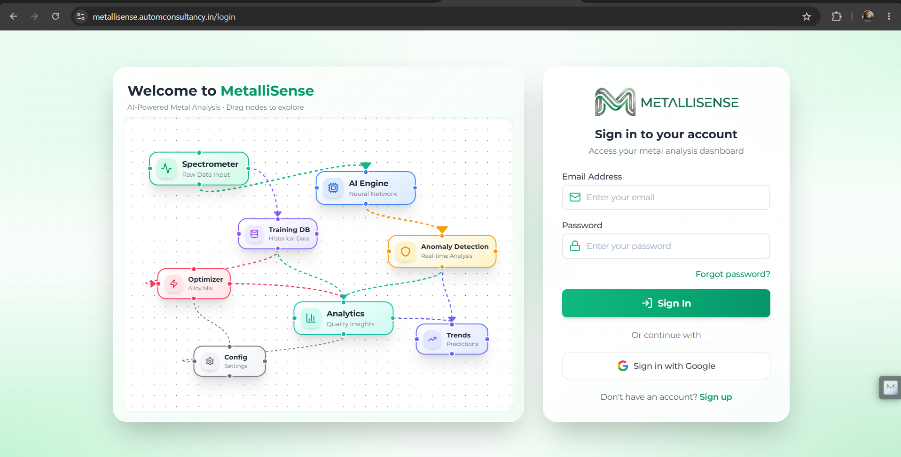
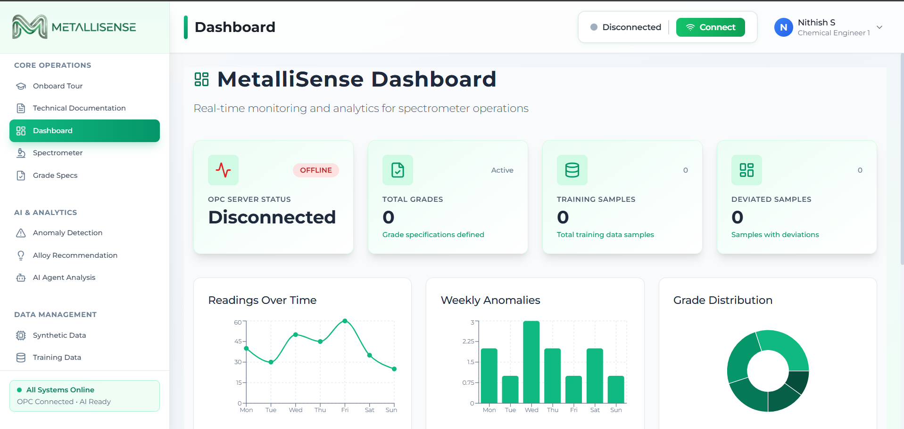
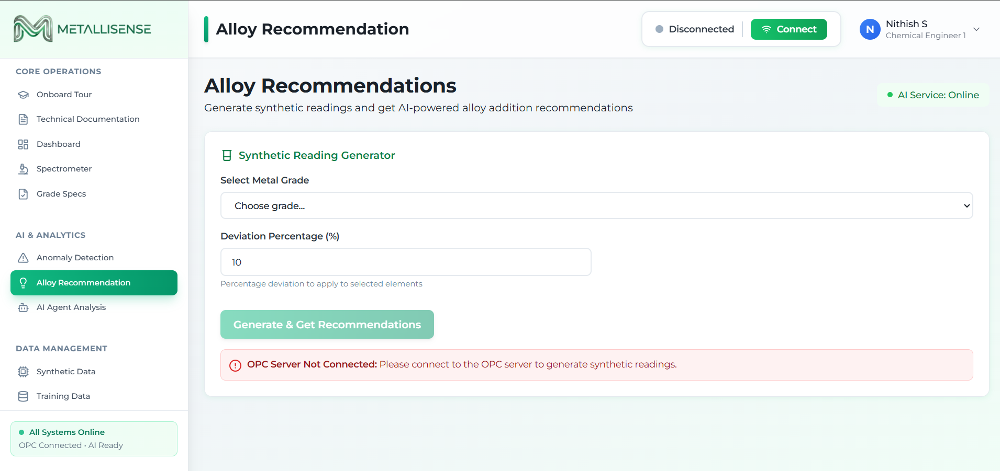
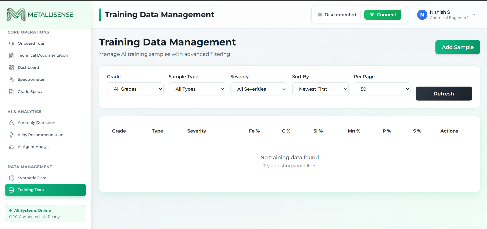

<div align="center">

# ⚗️ MetalliSense
### AI-Powered Metal Quality Intelligence for Sustainable Foundry Operations

[](https://metallisense.automconsultancy.in/)
[](https://sdgs.un.org/goals/goal9)
[](https://sdgs.un.org/goals/goal12)
[](https://sdgs.un.org/goals/goal13)

**A responsible AI decision-support system that detects composition anomalies in real-time spectrometer data, recommends corrective alloy additions, and explains every decision in plain language — reducing material waste, energy consumption, and batch rejection in metal foundries.**

[🌐 Live Application](https://metallisense.automconsultancy.in/) · [📹 Demo Video](https://drive.google.com/file/d/1YcFvbhEPZQXH12N0vtaymXmQ10tGVoB6/view?usp=drivesdk) · [📚 Agent Docs](Metallisense-Agent/DOCS/)

</div>

---

## 🌍 The Problem

Foundries — factories that cast metal components — are among the most resource-intensive industrial operations in the world. A single failed metal batch means:

- **Re-melting** at temperatures above 1400 °C — burning massive amounts of energy
- **Material waste** as off-spec alloys are discarded or downgraded
- **Invisible errors** — spectrometer readings can drift, produce outliers, or miss subtle deviations that the human eye cannot catch in time

The root cause is a **gap in decision intelligence**: foundry operators receive raw elemental composition numbers from spectrometers but lack immediate, explainable guidance on whether a reading is anomalous and what corrective action — if any — to take.

> *How might we use AI to detect composition anomalies and recommend corrective alloy additions so that foundry operations can become more sustainable — reducing waste, energy use, and rejected batches?*

---

## 💡 The Solution: MetalliSense

MetalliSense is an **agentic AI platform** that sits between the spectrometer and the operator. It does three things:

| Capability | What It Does |
|---|---|
| 🔍 **Anomaly Detection** | Isolation Forest ML model trained on 30,000 physics-aware samples classifies each reading as NORMAL / LOW / MEDIUM / HIGH deviation |
| ⚗️ **Alloy Correction** | Multi-output Gradient Boosting model recommends the minimum element additions to bring composition back to grade specification — hard-capped at 5% per element |
| 🗣️ **Explainable AI Copilot** | Groq LLM (llama-3.3-70b-versatile) translates ML scores into plain-language operator guidance with voice input/output in 12 languages |

The system is **advisory only**. It never acts autonomously. Every recommendation includes a confidence score and requires explicit human approval — a hard architectural invariant encoded in the `DecisionPolicy` layer.

---

## 🎯 SDG Alignment

<table>
<tr>
<td width="60"><b>SDG 9</b></td>
<td><b>Industry, Innovation & Infrastructure</b><br>Modernises a traditional industrial process (metal casting) with ML-driven decision support, OPC UA industrial protocol integration, and real-time agentic AI orchestration.</td>
</tr>
<tr>
<td><b>SDG 12</b></td>
<td><b>Responsible Consumption & Production</b><br>Recommends minimum alloy additions needed (not maximum), warns when total corrections exceed 3%, and reduces batch rejection rates — directly cutting raw material waste.</td>
</tr>
<tr>
<td><b>SDG 13</b></td>
<td><b>Climate Action</b><br>Every avoided re-melt at 1400 °C saves significant energy and associated CO₂ emissions. Tighter anomaly detection means fewer false negatives and fewer wasted heats.</td>
</tr>
<tr>
<td><b>SDG 8</b></td>
<td><b>Decent Work & Economic Growth</b><br>The Copilot is designed for foundry operators without ML backgrounds — voice-enabled, plain-language explanations in 12 languages keep humans in the decision loop rather than replacing them.</td>
</tr>
</table>

---

## 🖼️ Screenshots

<table>
<tr>
<td><br><sub>Dashboard — real-time spectrometer overview</sub></td>
<td><br><sub>AI Agent — anomaly score + alloy correction</sub></td>
</tr>
<tr>
<td><br><sub>Explainable AI Copilot — plain-language reasoning</sub></td>
<td><br><sub>Grade Specifications — composition range browser</sub></td>
</tr>
</table>

📹 **[Full Demo Video →](https://drive.google.com/file/d/1YcFvbhEPZQXH12N0vtaymXmQ10tGVoB6/view?usp=drivesdk)**

---

## 🏗️ How It Works

```
Spectrometer Reading
        │
        ▼
┌─────────────────────────┐
│   Node.js Rule Engine   │  ← Grade compliance check (PASS/FAIL)
└────────────┬────────────┘
             │
             ▼
┌─────────────────────────┐
│     Agent Manager       │  ← Orchestrates agents via DecisionPolicy
└──────────┬──────────────┘
           │
     ┌─────┴──────┐
     ▼            ▼ (only if MEDIUM or HIGH severity)
┌─────────┐  ┌──────────────┐
│ Anomaly │  │    Alloy     │
│  Agent  │  │  Correction  │
│ Always  │  │    Agent     │
│  runs   │  │  Conditional │
└────┬────┘  └──────┬───────┘
     └──────┬───────┘
            ▼
┌─────────────────────────┐
│   Explainable AI        │  ← Groq LLM + Voice (STT/TTS)
│   Copilot               │  ← "Why this addition? What's the risk?"
└─────────────────────────┘
            │
            ▼
     Operator Dashboard
  (Human Approval Required)
```

### Key Design Principles

- **Never autonomous** — `DecisionPolicy.is_action_allowed()` always returns `False`
- **Always explainable** — every agent output includes confidence score + natural language reasoning
- **Deterministic** — same composition input always produces the same anomaly score (training-time stats stored in model)
- **Stateless** — no memory between predictions; each analysis is independent

---

## 🧠 AI Components

| Component | Technology | Role |
|---|---|---|
| Anomaly Detection | Isolation Forest (scikit-learn) | Classifies composition as NORMAL/LOW/MEDIUM/HIGH deviation |
| Alloy Correction | MultiOutputRegressor + GradientBoosting | Predicts minimum additions per element to reach grade midpoint |
| Synthetic Training Data | Physics-aware generator (NumPy) | 30,000 samples across 5 metal grades with realistic deviation patterns |
| Explainable Copilot | Groq API — llama-3.3-70b-versatile | Translates ML output into operator-friendly explanations |
| Speech-to-Text | Groq Whisper large-v3 | Voice input for hands-free operator queries |
| Text-to-Speech | gTTS — 12 languages | Spoken explanations for accessibility |
| What-If Analysis | Gemini + Groq | "What happens if I skip the Mn addition?" |
| Audit Trail | Python RotatingFileHandler | Persistent log of every agent decision |

### Metal Grades Supported

`SG-IRON` · `GREY-IRON` · `LOW-CARBON-STEEL` · `MEDIUM-CARBON-STEEL` · `HIGH-CARBON-STEEL`

Elements tracked: **Fe · C · Si · Mn · P · S**

---

## 🗂️ System Architecture

```
Metallisense-1M1B/
│
├── Metallisense-Agent/          # Python 3.11 · FastAPI (port 8001)
│   └── app/
│       ├── agents/              # AnomalyAgent + AlloyAgent + wrappers
│       ├── policies/            # DecisionPolicy — orchestration rules
│       ├── copilot/             # Groq LLM explainer + voice services
│       ├── training/            # Model training scripts
│       ├── inference/           # Model serving
│       └── data/                # Grade specs + synthetic generator
│
├── MetalliSense-Node-Backend/   # Node.js · Express (port 3000)
│   ├── routes/                  # REST API v2 (Firebase-authenticated)
│   ├── services/                # AI service proxy + OPC UA + Gemini
│   └── models/                  # MongoDB schemas (Mongoose)
│
├── Metallisense-frontend/       # React 19 · Vite · Tailwind CSS
│   └── src/
│       ├── pages/               # Dashboard, AIAgent, AnomalyDetection…
│       └── services/            # API clients + Copilot service
│
└── Metallisense-AI/             # Base ML service (port 8000, reference)
```

---

## 🛡️ Responsible AI

This project was designed with responsible AI principles from the ground up — not added as an afterthought.

| Principle | Implementation |
|---|---|
| **Transparency** | Every prediction includes a confidence score (0–1) and a human-readable explanation. The Copilot uses structured prompts to explain *why* each element addition is recommended and *what happens if it is skipped*. |
| **Human-in-Loop** | `DecisionPolicy.requires_human_approval()` always returns `True`. No recommendation can be acted upon without explicit operator confirmation. A feedback button on every analysis lets operators confirm or reject the AI's suggestion — that data feeds model improvement. |
| **Fairness** | Training data is synthetically generated from metallurgical standards (not biased historical records). All five grades receive equal representation. |
| **No Autonomous Action** | `DecisionPolicy.is_action_allowed()` is hard-coded to return `False`. Agents cannot trigger furnace adjustments, procurement orders, or any physical action. |
| **Auditability** | Every agent decision is written to a rotating audit log (`logs/decisions.log`) with UTC timestamps, input hash, severity, and confidence. |
| **Privacy** | No personal data is collected. Authentication uses Firebase ID tokens. Composition readings are industrial measurements, not personal information. |
| **Bounded Recommendations** | Alloy additions are hard-capped at **5% per element**. The system warns operators when total additions exceed **3%** and suggests re-melting rather than over-correcting. |

---

## 🌱 Expected Impact

**If deployed across a mid-size foundry producing 500 batches/month:**

- Catching even **10% of batches** before re-melt could avoid **50 re-melt cycles/month**
- Each re-melt at 1400°C for a 1-tonne heat ≈ **600–900 kWh** of electricity
- Potential energy saving: **30,000–45,000 kWh/month** — equivalent to powering ~40 homes for a month
- Reduction in raw alloy additions through precision correction (vs. over-addition by experience)
- Operator upskilling: voice-driven AI explanations make metallurgical reasoning accessible to junior operators in their native language

---

## 🚀 Getting Started

### Prerequisites

- Python 3.11, Node.js 18+, MongoDB
- Groq API key (free tier at [console.groq.com](https://console.groq.com/keys))

### 1. Python AI Service (Agent + Copilot)

```powershell
cd Metallisense-Agent
python -m venv venv
venv\Scripts\activate          # Windows
pip install -r requirements.txt
python setup.py                # Generates data + trains both models
$env:GROQ_API_KEY="your_key_here"
python app/main.py             # Starts on http://localhost:8001
```

### 2. Node.js Backend

```powershell
cd MetalliSense-Node-Backend
# Create config.env with DATABASE, DATABASE_PASSWORD, PORT, GROQ_API_KEY
npm install
npm start                      # Starts on http://localhost:3000
```

### 3. Frontend

```powershell
cd Metallisense-frontend
npm install
npm run dev                    # Starts on http://localhost:5173
```

### 🌐 Or just use the live deployment

**[https://metallisense.automconsultancy.in/](https://metallisense.automconsultancy.in/)**

---

## 🧪 Running Tests

```powershell
# Python unit tests (no trained model required)
cd Metallisense-Agent
python -m pytest tests/test_decision_policy.py tests/test_schemas.py -v

# Integration test (API must be running)
python test_agent_system.py
```

---

## 📡 Key API Endpoints

| Method | Endpoint | Description |
|---|---|---|
| `POST` | `/api/v2/ai/agent/analyze` | Full agentic analysis (anomaly + alloy + copilot) |
| `POST` | `/api/v2/ai/anomaly/predict` | Anomaly detection only |
| `GET` | `/api/v2/ai/results` | Paginated analysis history |
| `PATCH` | `/api/v2/ai/results/:id/feedback` | Operator confirms/rejects recommendation |
| `POST` | `/api/v2/ai/explain` | Gemini-powered natural language explanation |
| `POST` | `/api/v2/ai/what-if` | What-if scenario analysis |
| `GET` | `/api/v2/ai/health` | Service health check |

Interactive API docs: [http://localhost:8001/docs](http://localhost:8001/docs)

---

## 🧩 Design Thinking Journey

**Empathize** — Foundry operators receive raw elemental percentages from spectrometers. They rely on experience to judge whether a reading is safe. Junior operators lack this intuition; senior operators are a bottleneck.

**Define** — *There is no accessible, explainable, real-time decision-support tool that bridges the gap between spectrometer output and metallurgical expertise.*

**Ideate** — Use unsupervised ML (Isolation Forest) to learn what "normal" looks like, use regression to recommend corrections, and use LLMs to explain both in plain language — keeping the human in charge.

**Prototype** — Physics-aware synthetic dataset → trained ML models → FastAPI agent service → Node.js API gateway → React dashboard with voice-enabled copilot.

**Test & Refine** — Added `DecisionPolicy` layer after recognising that agents needed guardrails. Added composition sum validation after finding malformed inputs reached the model. Added operator feedback loop to create a path from advisory AI to continuously improving AI.

---

## 🔧 Tech Stack

| Layer | Technology |
|---|---|
| ML / AI | scikit-learn · Groq (llama-3.3-70b + Whisper) · Google Gemini · ElevenLabs |
| Backend (AI) | Python 3.11 · FastAPI · Pydantic · joblib |
| Backend (API) | Node.js · Express · MongoDB · Mongoose · Firebase Auth |
| Frontend | React 19 · Vite · Tailwind CSS · Recharts · XY Flow |
| Industrial | OPC UA (node-opcua) |
| Infrastructure | Vercel (frontend) · Firebase Authentication |

---

## 📄 License

Part of the **1M1B × IBM SkillsBuild × AICTE AI for Sustainability Virtual Internship**.  
Built to demonstrate how AI can be applied responsibly to real industrial sustainability challenges.

---

<div align="center">

*"The goal is not to replace the metallurgist — it is to give every operator the confidence of one."*

**[🌐 Try MetalliSense Live](https://metallisense.automconsultancy.in/)**

</div>
